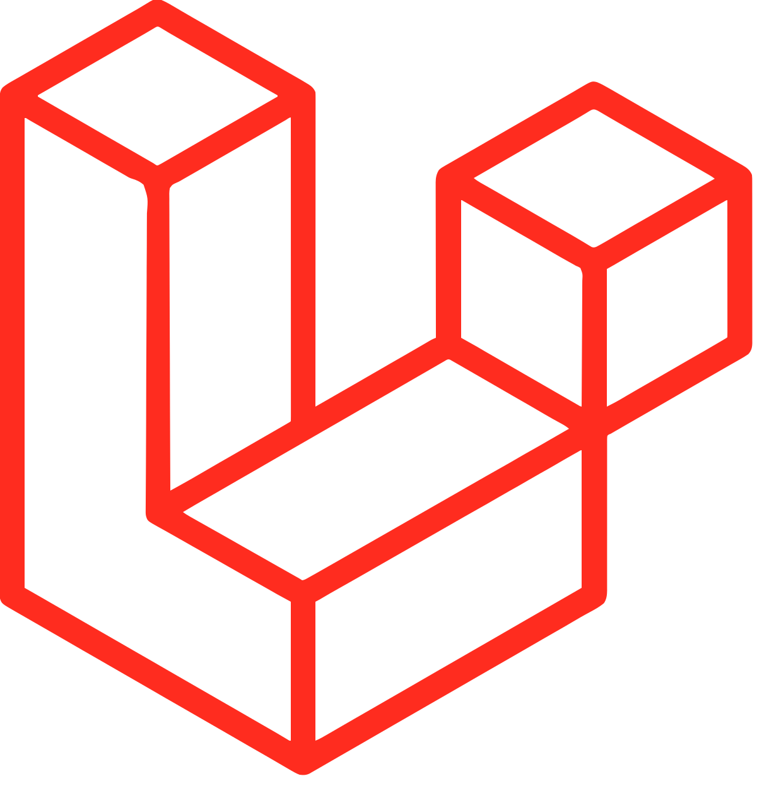

# Hi there! 👋 I'm Nick Wilson

https://niccholasw.cloud/

Welcome to my GitHub! I'm a passionate software engineer currently studying in New Zealand. I love solving problems, building projects, and learning new technologies. Here's a bit about me:

## 🛠 Tech Stack

### Languages & Tools:

  <!-- Java -->
  
  <!-- JavaScript -->
  
  <!-- Python -->
  
  <!-- PHP -->
  
  <!-- Laravel -->
  
  <!-- PostgreSQL -->
  
  <!-- React -->
  
  <!-- Node.js -->
  
  <!-- Tailwind CSS -->
  
  <!-- MongoDB -->
  
  <!-- Express -->
  
  <!-- Git -->
  

### 🧰 Tools I Use:

- Git & GitHub
- Visual Studio Code
- WSL

### 🌱 Currently Learning:

- Machine Learning (Python, TensorFlow)
- Website Development (MERN Stack, Laravel)

## 📚 Projects

### 🃏 Beating the Casino (Python)

- **Blacjack machine learning**: Working on training a machine learning model to optimise casino betting on Blackjack (21), and using it to train humans for real world card counting applications to make a profit.

### 🌐 Web Development (MERN Stack) - [Link](https://desserts.wdcc.co.nz/)

- **University of Auckland Desert Society Website**: Created a user-friendly and accessible website using React, Node, and Tailwind for the University of Auckland Dessert Society🍩.

### 🎮 Game Development (Java)

- **Museum Thief Investigation**: A game where players uncover clues and solve a mystery in a museum setting.

## 📫 How to reach me:

- [LinkedIn](https://www.linkedin.com/in/nicholaswww/)
